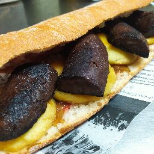

# Botifarra

### **Entrepà de botifarra esparracada, ceba confitada, pebrot escalivat i formatge fos**

## Ingredients

* 1 botifarra de pagès
* Ceba confitada
* Pebrot escalivat
* Formatge Havarti
* 1 xapata rústica
* Tomàquet (Per sucar el pa)
* Oli d’oliva verge extra
* Sal
* (La quantitat dels ingredients pot variar segons els nostres gustos)

## Elaboració

Suposo que sabeu bé prou que és o com es fa la botifarra esparracada, consisteix en treure-li la tripa i cuinar-la com si fos carn picada, a mida que la anem coent, es va esmicolant.
Quan la tenim mig feta, afegim a la paella el pebrot escalivat i la ceba confitada i li donem uns quants tombs fins que la tinguem cuita.
Suquem el pa amb tomàquet, l’oli i la sal (Compte amb la sal ja que les botifarres elaborades normalment ja en porten) I hi posem la farsa. Al damunt hi posem uns tallets primets de fomatge Havarti i el posem al forn o salamandra un parell de minuts fins que el formatge sigui fos.
Hem utilitzat aquest tipus de formatge, perquè a nosaltres ens agrada molt, fon ràpid, queda molt melós i no massa fort de gust, però podem posar-hi qualsevol formatge que fongui bé i ens agradi.
Si no disposem de ceba confitada, ho podem fer-ho amb ceba crua, coent-la abans de la botifarra.
Així mateix podem comprar el pebrot ja escalivat o una llauneta de pebrot de qualitat.
De totes maneres, us puc assegurar, que si feu la recepta original, és molt més bo, amb diferència. I superior a “algunes” hamburgueses.

Per [Eduard Lluis Palaus](https://www.receptes.cat/recepta6197/entrepa_de_botifarra_esparracada_ceba_confitada_pebrot_escalivat_i_formatge_fos)