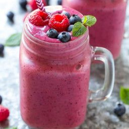

# Smoothie

### **Smoothie de cirera**

## Ingredients

* 50 g d’ametlles
* 4 iogurts naturals
* 2 plàtans
* 300 g de cireres
* 8 cullerades de granola de fruites vermelles
* 4 cullerades de pistatxos pelats

## Elaboració

1. Poseu les ametlles en remull la nit anterior o almenys unes 6-8 hores abans.
2. Al mateix temps que les ametlles, congeleu els plàtans pelats i trossejats.
3. Poseu a la gerra d’una batedora amb bona potència els plàtans, els iogurts, les ametlles escorregudes i les cireres (reserveu-ne algunes); bateu-ho a velocitat màxima.
4. Repartiu l’smoothie en quatre bols, afegiu-hi la granola, els pistatxos i les cireres que heu reservat.

Per [Ametller Origen](https://ametllerorigen.cat/ca/receptes/receptes-de-batuts-i-smoothies/bol-de-smoothie-bol.html)